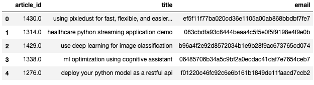
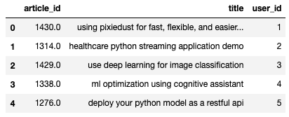
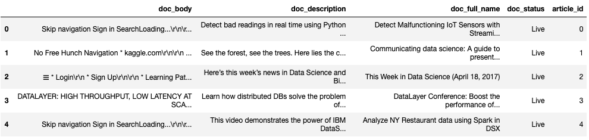

# Recommendation-Engine
Recommendation engine created for the Udacity Data Scientist Nanodegree


# Overview 
The goal of this project was to get an introduction into the different kinds of recommendations and how they work. The project was sponsored by IBM and they provided the data, one file being records of every user-article interaction and the other being information about each article. The project through Udacity required us to implement rank based and user-user based recommendation functions. In addition to these functions I chose to implement a content based recommendation and combined all of these functions into the 'User' class.  

# Files
* Data - Folder containg data in .csv files
* demo_script.py - Example using the User class
* exploratory_notebook.ipynb - Notebook where I developed the functions originally 
* install_nltk.py - File to solve the issue I had with using the nltk.download() function 
* user.py - File containing the class 'User' 

# Data
## Interaction Data Before Mapping 'email' to 'user_id'

## Interaction Data with 'user_id'


## Content Data


# User Class
## Initialize 
```python
user = User(user_id, interaction_df, content_df)
```
## Methods 
```python
user.most_popular_articles(n_articles, ids=False)
user.other_user_recommendation(n_recs, ids=False)
user.conent_based_recommendation(n_recs, ids=False)
user.similar_users(n_users)
``` 
Setting ```ids=True``` will return article ids instead of article names

# Recommendations
## Rank Based Recommendation 
This recommendation returns the most popular articles throughout all of the users and is used when recommending articles to users who have not yet read any articles. 

## User-User Recommendation 
This recommendation looks at users with similar reading habits and finds articles that the similar users have seen but the user recieving the recommendation has not. 

## Content Based Recommendation 
This recommendation tokenizes every article that a user has watched and then compares unique tokens with other articles the user has not seen. The articles with the most similarties are recommended. 

* I could have included the words in the article but I felt that simplifying and using only the title was appropriate for this situation
* This recommendation has a bias towards articles with longer title names
* This recommendation does not properly account for users who view multiple articles with similarly worded titles


# Summary
This project was a great intro into the many different ways that recommendations can be made. Somethings that I could have done differently are:  
* Make the class Recommendation instead of User. I debated this but chose User because it felt like a better object oriented approach. If I went with Recommendation the user_id variable would no longer be a part of the class and become a parameter for the recommendations method. My approach allows each user to have its own instance and then potentially add other variables depending on the situation. Having user be a parent class for Recommendation may also work here.
* Include the body of the article in the content based recommendation rather than just the title. Because this was my first time creating a recommendation engine I wanted to keep it simple.
